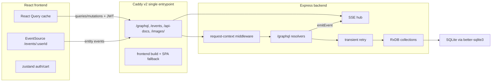

# Restaurant Management System

Full-stack MERN restaurant platform — menu, orders, reservations, tables and admin settings with real-time updates, role-based access and an optimized GraphQL API.

## Features

- **Dashboard** – aggregated stats via `dashboardStats` (orders/reservations by status, revenue, tables occupancy, today counts, recent orders). Single query replaces 3 list fetches.
- **Menu** – CRUD (admin), category filter, `available` flag. Cards are memoized, lazy-loaded images.
- **Orders** – create/edit (pending), status flow `pending → preparing → completed/cancelled`, `completed/cancelled` deletable. Table occupancy check (`Table is busy`), `TableSelect` dropdown.
- **Reservations** – create/edit (`confirmed`), `completed`/`cancelled` deletable, staff status select.
- **Tables** – `tableCount` from `RestaurantSettings` drives `TableSelect` everywhere; `tables` query computes busy from `pending`/`preparing` orders + `confirmed` reservations.
- **Settings (admin)** – Restaurant details (name/logo/address/phone/email/`tableCount`), Users (create/delete/role change), Categories (CRUD). Tabs are lazy-loaded.
- **Real-time** – SSE events (`menu:changed`, `orders:changed`, `reservations:changed`, `categories:changed`, `users:changed`, `settings:changed`, `tables:changed`, `logs:changed`) auto-patch `react-query` caches (see Architecture).

## Tech Stack

- **Frontend:** React 18 (CRA 5 + TypeScript), React Router 6, `@tanstack/react-query` 5, `zustand` (auth/cart), `react-hook-form` + `zod`, `graphql-request` + `@apollo/client` (`gql` docs), `@mui/material` styled with **Tailwind CSS**, native `EventSource` (SSE), Testing Library/Jest
- **Backend:** Node 18+, Express 4, RxDB 17 + SQLite (`@basepurpose/rxdb-sqlite`, `better-sqlite3`), TypeScript (`moduleResolution: node16` — imports require `.js` suffix), GraphQL (`graphql` + `express-graphql`, `graphiql: true`), `jsonwebtoken` + `bcryptjs`, `node-sse-hub` (SSE), `node-retry-kit` (transient retry), `async-context-kit` (request correlation), `zod`, `moment`, `swagger-jsdoc`/`swagger-ui-express`
- **Auth:** JWT Bearer (`protect` → `req.user`), `admin`/`staff` guards; frontend `useAuthStore` persists `user+token` in `localStorage`
- **Testing:** Backend Jest + `ts-jest` (ESM), Frontend `react-scripts` Jest + Testing Library

## Project Structure

```
backend/
  config/db.ts                Mongoose connection
  graphql/
    typeDefs.ts               SDL (User, MenuItem, Category, Order, Reservation, RestaurantSettings, TableStatus, DashboardStats, StatusCount)
    helpers/
      formatters.ts           formatUser, formatMenuItem/Category/Order/Reservation/RestaurantSettings, getOrCreateRestaurantSettings
      auth.ts                 requireAuth, requireAdmin, requireStaffOrAdmin
    resolvers/
      auth.ts, menu.ts, order.ts, reservation.ts, category.ts, settings.ts, tables.ts, dashboard.ts
      index.ts                merged root resolvers
    schema.ts                 buildSchema(typeDefs) + root
    validation.ts             Zod schemas + validate()
  models/                     User, MenuItem, Category, Order (indexed), Reservation (indexed), RestaurantSettings
  middleware/auth.ts
  routes/                     REST routers (legacy, commented out in server.ts)
  server.ts                   Express + /graphql + /api-docs + socket init
  socket.ts                   emitEvent / initSocket
  seeds.ts
  tests/                      Jest suites (validation, formatters, auth, typeDefs, resolvers)
  jest.config.cjs
  tsconfig.json               node16

frontend/
  src/
    api/queries.ts            graphql-request + useAuthStore token, mapId/mapArray, use* hooks (staleTime 30-60s, dashboardStats invalidation)
    graphql/queries.ts        gql documents (GET_MENU_ITEMS, GET_DASHBOARD_STATS, etc.)
    store/                    authStore (zustand), cartStore
    validation/schemas.ts     Zod schemas for forms
    hooks/useSocket.ts        invalidates queries on socket events (incl. dashboardStats)
    components/
      PageHeader.tsx          reusable flex justify-between header (replaces repeated className)
      FilterBar.tsx, StatusBadge.tsx, SectionCard.tsx, TableSelect.tsx, LoadingSpinner, etc.
      pages/
        DashboardStatCard.tsx, MenuCategoryFilter.tsx, OrderCard.tsx, ReservationCard.tsx, TableCard.tsx,
        MenuItemCard.tsx (memo + lazy image), MenuItemForm.tsx, OrderForm.tsx, ReservationForm.tsx,
        UserForm.tsx, UserTable.tsx, CategorySection.tsx, RestaurantSection.tsx
    pages/                    Dashboard, Menu, Orders, Reservations, Tables, Settings, Home, Login, Register
    App.tsx                   lazy routes + global useIsFetching/useIsMutating overlay
    setupTests.ts
  tailwind.config.js, postcss.config.js   Tailwind at root, utilities in src/index.css (@layer components)
```

## Getting Started

### Prerequisites

- Node.js 18+
- No external database — data is stored locally via RxDB/SQLite
  (`better-sqlite3`)

### Environment

Create `backend/.env` from `backend/.env.example`:

```
PORT=5000
JWT_SECRET=your_jwt_secret
```

Frontend proxy is `http://localhost:5000` (`frontend/package.json:proxy`) or set `REACT_APP_GRAPHQL_URL=http://localhost:5000/graphql`.

### Install & Run

```bash
# Backend
cd backend
npm install --legacy-peer-deps
npm run seed        # seed sample data
npm run dev         # tsx + nodemon (handles .js extensions)

# Frontend
cd frontend
npm install --legacy-peer-deps
npm start           # CRA dev server
# open http://localhost:3000  (GraphiQL at http://localhost:5000/graphql)
```

### Build

```bash
cd backend && npm run build     # tsc -> dist/
npm start                        # node dist/server.js

cd frontend && npm run build    # build/
```

### Caddy (production reverse proxy)

Root `Caddyfile` (Caddy v2, validated with `caddy validate`) exposes one public
entrypoint: `/graphql*`, `/events*` (SSE, unbuffered via `flush_interval -1`)
and `/api-docs*` proxy to the backend (`$BACKEND_UPSTREAM`, default
`localhost:5000`); everything else serves the frontend `build/` output mounted
at `/srv/frontend` with SPA fallback to `index.html`. Full HTTPS deployment
guide (DNS, firewall, commands): [`docs/DEPLOYMENT.md`](docs/DEPLOYMENT.md).

```bash
# Build the frontend with same-origin API URLs, then serve via Caddy
cd frontend && REACT_APP_GRAPHQL_URL=/graphql REACT_APP_WS_URL= npm run build
# cp -r build /srv/frontend  (or mount ./frontend/build -> /srv/frontend)
DOMAIN=restaurant.example.com BACKEND_UPSTREAM=localhost:5000 caddy run
```

`REACT_APP_WS_URL=` (empty) means same-origin `/events`
(`frontend/src/eventSource.ts`); a local-dev variant proxying to the CRA dev
server (`$FRONTEND_UPSTREAM`, default `localhost:3000`) is commented in the
Caddyfile.

### Testing

```bash
# Backend — 18 suites, 180 tests (incl. retry, request-context, SSE hub)
cd backend && npm test                 # jest --runInBand
npm run test:coverage

# Frontend — 13 suites, ~73 tests
cd frontend && npm test                # react-scripts test --watchAll=false
npm run test:coverage
```

## Seed Credentials

| Role | Email | Password |
|------|-------|----------|
| Admin | admin@restaurant.com | admin123 |
| Staff | staff@restaurant.com | staff123 |
| Customer | john@example.com | customer123 |
| Customer | jane@example.com | customer123 |
| Customer | bob@example.com | customer123 |

## API

Active API is **GraphQL** at `POST /graphql` (`backend/graphql/*`, `express-graphql`). REST routers in `backend/routes/*` are currently commented out in `server.ts`.

- **Swagger:** `GET /api-docs` (REST docs, legacy)
- **GraphiQL:** enabled at `/graphql` when `graphiql: true`

### Key Queries / Mutations

```graphql
query GetDashboardStats {
  dashboardStats {
    totalOrders pendingOrders completedOrders totalRevenue
    totalReservations confirmedReservations
    totalMenuItems availableMenuItems totalUsers totalCategories
    totalTables busyTables freeTables todayOrders todayReservations
    recentOrders { id totalAmount status }
    ordersByStatus { status count }
  }
}
query GetMenuItems($category: String) { menuItems(category: $category) { id name price category } }
mutation CreateOrder($items: [OrderItemInput!]!, $tableNumber: Int) { createOrder(items: $items, tableNumber: $tableNumber) { id totalAmount } }
```

All `graphql-request` calls in `frontend/src/api/queries.ts` attach `Authorization: Bearer <token>` from `useAuthStore`.

## Auth & Roles

- `protect` → JWT → `req.user`; `admin` → `role==='admin'`; `staff` → `admin|staff`.
- Frontend `useAuth()` + `ProtectedRoute`; backend `requireAuth`/`requireAdmin` checks.
- Gates: Menu add/edit → admin; Settings → admin; Tables → staff/admin; Orders/Reservations filters & status changes respect role.

## Domain Rules

- Categories via DB (`/settings` → `CategorySection`), `MenuItem.category` refs DB (no enum).
- Menu edit: click card → form with DB defaults.
- Order: `pending` editable; `completed`/`cancelled` deletable. Reservation: `confirmed` editable; `completed`/`cancelled` deletable.
- `tableCount` in `RestaurantSettings` drives `TableSelect`; busy tables are labeled but selectable → backend error `Table is busy`.

## Styling

- Use **Tailwind** `className` for MUI components (`<Button className="!bg-[#e94560]">`) — avoid `sx` except for MUI layout props.
- Utilities in `frontend/src/index.css` `@layer components`: `section-card`, `card`, `form-panel`/`form-input-sm`, `table-card`, `filter-bar`, `page-heading`, `btn-*`, `spinner`, etc. Never use inline `style=` or new CSS files.

## Notes

- **TypeScript quirk:** `backend/tsconfig.json` is `node16` → relative imports must use `.js` (e.g. `from './config/db.js'`). Run via `tsx` in dev (`npm run dev`), `tsc` in build. Third-party packages that ship dual CJS+ESM builds (`node-retry-kit`, `async-context-kit`, `node-sse-hub`) resolve correctly at every runtime, but `tsc` reports TS1479 on their static imports — see the documented `@ts-expect-error` in `backend/retry.ts`.
- **Optimization:** lean queries + indexes (`Order.status+tableNumber`, `Reservation.status+tableNumber+date`, `MenuItem.category+available`), `Promise.all` in `dashboardStats`, `staleTime`/`gcTime` in react-query, `React.memo`/`useMemo`/`useCallback`, lazy images/tabs, `dashboardStats` invalidated on all relevant mutations/socket events.
- **Recent refactor:** `PageHeader` (`flex justify-between items-center mb-2`) extracted; `backend/graphql/schema.ts:674` split into `typeDefs` + `helpers` + 8 resolver modules; frontend `OrderList`/`ReservationList`/`UserSection`/`Tables` split into `OrderCard`/`ReservationCard`/`UserTable`/`TableCard` etc.

## Architecture




1. **React frontend** — routes in `frontend/src/pages/`, sections in `src/components/pages/`, data via typed React Query hooks (`src/api/queries.ts`), client state in zustand. No direct DB access; the single server contract is GraphQL + SSE.
2. **RxDB** — server-side embedded database (`backend/config/rxdb.ts`, 7 collections). There is **no** RxDB client/replication on the frontend: "synchronization" is GraphQL for reads/writes plus SSE notifications that patch the React Query cache. No redundant sync framework sits on top.
3. **GraphQL** — sole API at `POST /graphql` (`express-graphql`, SDL in `graphql/typeDefs.ts`, resolvers per domain). Errors are coded `AppError`s surfaced as `extensions.code`; the frontend renders them only through `getGraphQLErrorMessage`.
4. **Express backend** — `server.ts` awaits `connectDB()` before `listen()`; JWT Bearer auth (`protect`/`admin`/`staff`) enforced in resolvers via `requireAuth`/`requireAdmin`/`requireStaffOrAdmin`, mirrored by frontend route/gate hiding.
5. **SQLite** — persistence via `@basepurpose/rxdb-sqlite` (`better-sqlite3`), single file (`restaurant-db.db`, volume-mounted in Docker). Concurrent writes can surface transient `SQLITE_BUSY`/`SQLITE_LOCKED` — handled by retry (7), never by adding infrastructure.
6. **SSE** — live invalidation events (`menu/orders/reservations/categories/users/settings/tables/logs:changed`, deletes as `{ id, deleted: true }`) from `backend/sse.ts` (`node-sse-hub`); the frontend `useEventSource` hook upserts/removes entities in the React Query cache and invalidates derived queries (`tables`, `dashboardStats`). Heartbeat comments every 15s keep the stream alive through Caddy (`flush_interval -1`); the browser `EventSource` reconnects on its own.
7. **Retry handling** — `backend/retry.ts` (`node-retry-kit`): exponential backoff, full jitter, 3 retries, 1s max delay, retry _only_ transient failures (SQLite lock codes/messages, retryable network codes/statuses, attempt timeouts). `AppError`s (validation/auth/permission/not-found/conflict) never retry; the original error is rethrown unwrapped so GraphQL codes are preserved; attempts are logged with the request correlation id. Applied to order writes (`orders.insert/update/remove`) and the best-effort activity-log insert.
8. **Request/correlation IDs** — `backend/requestContext.ts` (`async-context-kit`): middleware mints/propagates `x-request-id` (validated, echoed on the response), visible through all async work via `AsyncLocalStorage`. Access logs carry the id; `getLogContext()` exposes only `{ requestId, userId }` — tokens, passwords, cookies and bodies are never stored.
9. **Synchronization flow** — mutation → RxDB write (with transient retry) → `emitEvent` (except-sender) → clients upsert/invalidate React Query caches. Responsibilities stay separated: RxDB = server persistence, GraphQL = operations, SSE = notifications, React Query = client state.

### Integrated NPM packages

| Package             | What                                                                                      | Why / problem solved                                                                                                                                                                                  | Where                                                                                            |
| ------------------- | ----------------------------------------------------------------------------------------- | ----------------------------------------------------------------------------------------------------------------------------------------------------------------------------------------------------- | ------------------------------------------------------------------------------------------------ |
| `node-retry-kit`    | Zero-dep retry with exponential backoff, jitter, timeouts, abort, `shouldRetry`           | Transient `SQLITE_BUSY` under concurrent staff devices failed mutations outright; hand-rolled sleep loops would lack jitter/caps/cancellation                                                         | `backend/retry.ts`, used in `graphql/resolvers/order.ts`, `graphql/helpers/activityLog.ts`       |
| `async-context-kit` | `AsyncLocalStorage` request scope + Express middleware, zero deps                         | No correlation existed (plain `morgan('dev')` logs); needed request IDs across async resolver chains without threading args or risking cross-request leaks                                            | `backend/requestContext.ts`, `backend/server.ts` (middleware, morgan `:request-id`, user attach) |
| `node-sse-hub`      | Hub-registry SSE: connection tracking, heartbeat, backpressure, stats; zero required deps | The hand-rolled client `Set` leaked every disconnect (`delete` built a fresh object), had no backpressure/caps/stats; the hub fixes the leak and adds operational control with the same wire contract | `backend/sse.ts` (same `initSSE`/`emitEvent` signatures; resolvers untouched)
